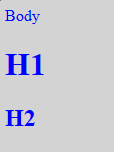
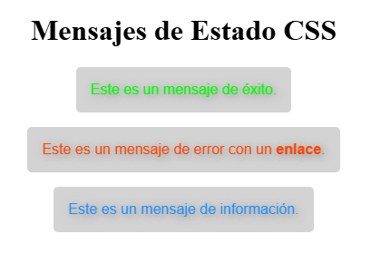
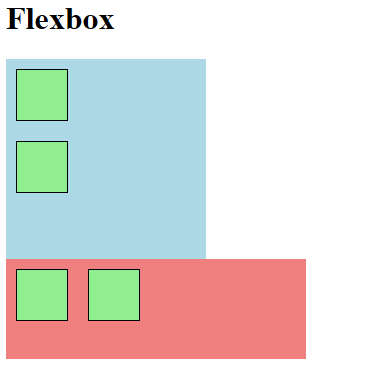
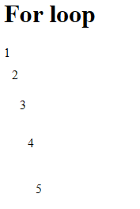

# Práctica SASS

### **Ejercicio 1**: Crea un parcial de definición de de las variables para el color primario y secundario y utilizarlo para definir estilos para el body y los títulos h1 h2. Verifica que las variables se hayan aplicado correctamente.

```scss
// _colors.scss
$primary: blue;
$secondary: lightgrey;
```

```scss
// styles.scss
@import "_colors.scss";

body, h1, h2 {
  color: $primary;
  background-color: $secondary;
}
```

```css
/* styles.css */
body, h1, h2 {
  color: blue;
  background-color: lightgrey;
}
```



### **Ejercicio 2**: Construye una hoja de estilos Sass para un sistema de mensajes de estado (como alertas de éxito, error o información) que sea modular, DRY (Don't Repeat Yourself) y fácil de mantener. Crea el estilo base en un parcial que no se compile por sí sólo, úsalos para definir estilos específicos para mensajes informativos, de error y de éxito. El color del fondo debe ser acorde con lo que representan. Además los enlaces dentro del mensaje de error deben estar en negrita. Comprueba que se transpila correctamente.

```scss
// _variables.scss
$success: lime;
$error: red;
$info: blue;
$shadow: dimgrey;
$background: lightgrey;
```

```scss
// _status.scss
%status_base {
  font-family: sans-serif;
  padding: 1rem;
  border-radius: 5px;
  margin: 1rem auto;
  background-color: $background;
  text-shadow: 2px 2px 10px $shadow;
  display: block;
  width: fit-content;
}
```

```scss
// styles.scss
@import "_variables.scss";
@import "_status.scss";

body {
  text-align: center;
}

.status {
  
  &--success {
    @extend %status_base;
    color: $success;
  }
  
  &--error {
    @extend %status_base;
    color: $error;
    a {
      font-weight: bold;
      &:hover {
        text-decoration: underline;
      }
    }
  }
  
  &--info {
    @extend %status_base;
    color: $info;
  }
}
```

```css
/* styles.css */
.status--success, .status--error, .status--info {
  font-family: sans-serif;
  padding: 1rem;
  border-radius: 5px;
  margin: 1rem auto;
  background-color: lightgrey;
  text-shadow: 2px 2px 10px dimgrey;
  display: block;
  width: fit-content; }

body {
  text-align: center; }

.status--success {
  color: lime; }
.status--error {
  color: red; }
  .status--error a {
    font-weight: bold; }
    .status--error a:hover {
      text-decoration: underline; }
.status--info {
  color: blue; }
```



### Ejercicio 3: Crea dos mixins, uno que permita establecer la dirección de un contenedor flexbox y el otro que permita dar un tamaño específico en un elemento. Verifica que transpila y funciona correctamente sobre algún ejemplo.

```scss
// _mixins.scss
@mixin direction($dir: row) {
  display: flex;
  flex-direction: $dir;
}

@mixin size($width: auto, $height: auto) {
  width: $width;
  height: $height;
}
```

```scss
// styles.scss
@import "_mixins.scss";

.box-1 {
  @include direction(column);
  @include size(200px, 200px);
  background: lightblue;
}

.box-2 {
  @include direction(row);
  @include size(300px, 100px);
  background: lightcoral;
}

.box-3 {
  @include direction();
  @include size(50px, 50px);
  background: lightgreen;
  border: 1px solid black;
  margin: 10px;
}
```

```css
/* styles.css */
.box-1 {
  display: flex;
  flex-direction: column;
  width: 200px;
  height: 200px;
  background: lightblue; }

.box-2 {
  display: flex;
  flex-direction: row;
  width: 300px;
  height: 100px;
  background: lightcoral; }

.box-3 {
  display: flex;
  flex-direction: row;
  width: 50px;
  height: 50px;
  background: lightgreen;
  border: 1px solid black;
  margin: 10px; }
```



# Ejercicio 4: Utiliza un bucle @for para generar 5 clases de espaciado llamadas margin-1 a .margin-5. Cada clase debe tener un margin que se incremente en 10px por cada iteración. Transpila el archivo y revisa el CSS generado.

```scss
// styles.scss
@for $i from 1 through 5 {
  .margin-#{$i} { 
    margin: 10px * ($i - 1);
  }
}
```

```css
/* styles.css */
.margin-1 {
  margin: 0px; }

.margin-2 {
  margin: 10px; }

.margin-3 {
  margin: 20px; }

.margin-4 {
  margin: 30px; }

.margin-5 {
  margin: 40px; }
```

